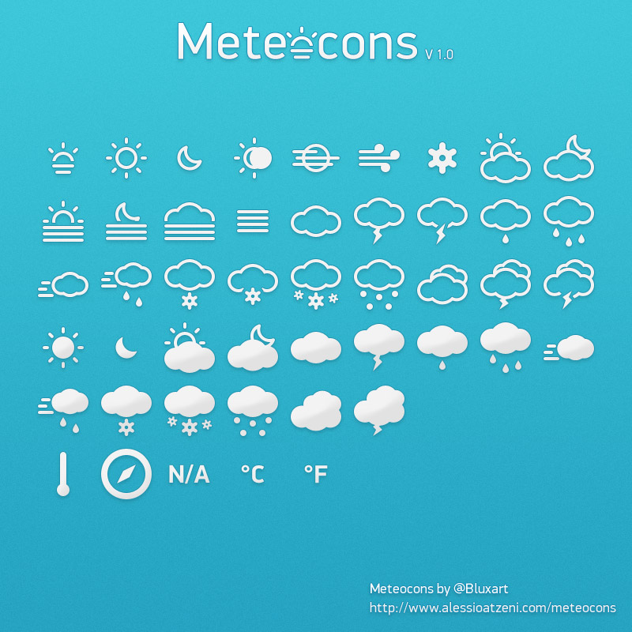

# Weather

###Description
Simple site that gives weather information from a search form.  The site uses Ajax calls to the Open weather map API and appends the information to the DOM with jQuery.  Additional styling from Pure.css and icons from Meteocons.  This started as a homework assignment at General Assembly, but I wanted to improve upon it a bit more.

###Styling/Icons
- [Pure.css](http://www.purecss.io)
- [Meteocons](http://www.alessioatzeni.com/meteocons/)

